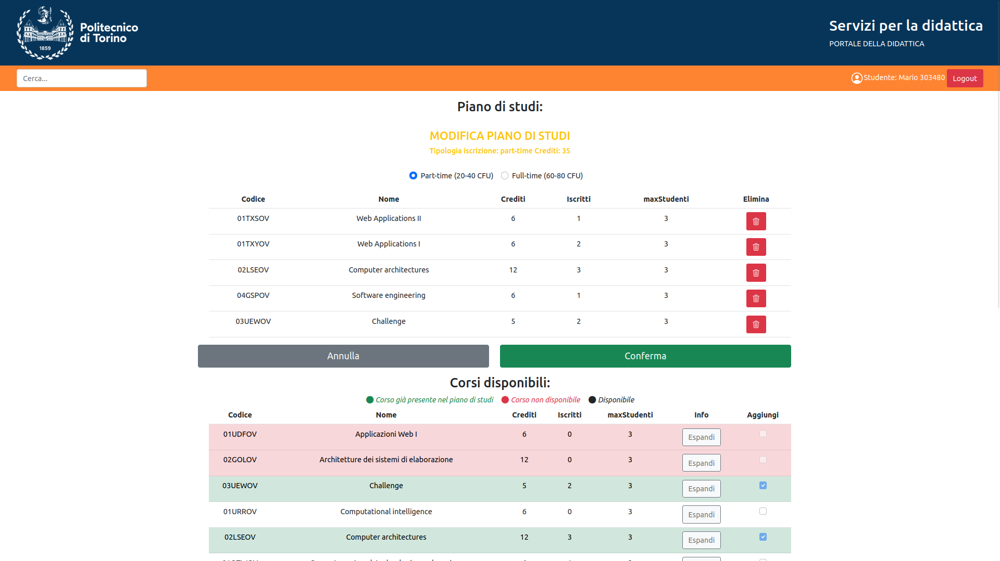

# Piano di studi
## React Client Application Routes

- Route `/`: homepage logged-in o logged-out
- Route `/login`: pagina per login

## API Server

- GET `/api/corsi`

  - Descrizione: Ottiene le informazioni relative a tutti i corsi disponibili.

  - Request body: _None_

  - Response: `200 OK` (success) or `500 Internal Server Error` (generic error).

  - Response body: Un array di oggetti, ognuno che descrive un corso.

```
[
  { codice: "01TYMOV",
  codicePropedeutico: "",
  crediti: 12,
  iscritti: 0,
  maxStudenti: 3,
  nome: "Information systems security services" },

  { codice: "04GSPOV",
  codicePropedeutico: "02LSEOV",
  crediti: 6,
  iscritti: 1,
  maxStudenti: 3,
  nome: "Software engineering" },
...
]
```

- GET `/api/incompatibili`

  - Descrizione: Ottiene le informazioni relative a tutti i corsi 
  incompatibili.

  - Request body: _None_

  - Response: `200 OK` (success) or `500 Internal Server Error` (generic error).

  - Response body: Un array di oggetti, ognuno che descrive un corso.

```
[
  { codice: "01NYHOV",
  codiceIncompatibile: "02GRSOV",
  crediti: 6,
  iscritti: 0,
  maxStudenti: 3,
  nome: "Programmazione di sistema" },

  { codice: "01OTWOV",
  codiceIncompatibile: "02KPNOV",
  crediti: 6,
  iscritti: 0,
  maxStudenti: 3,
  nome: "Tecnologie e servizi di rete" },
...
]
```

- GET `/api/corsi/pianoDiStudi`

  - Descrizione: Ottiene le informazioni relative a tutti i corsi 
  del piano di studi della matricola che ha effettutato il login.

  - Request body: _None_

  - Response: `200 OK` (success) or `500 Internal Server Error` (generic error).

  - Response body: Un array di oggetti, ognuno che descrive un corso.

```
[
  { codice: "01URROV",
  codicePropedeutico: "",
  crediti: 6,
  iscritti: 1,
  maxStudenti: 3,
  nome: "Computational intelligence ",
  tipoIscrizione: "part-time" },

  { codice: "04GSPOV",
  codicePropedeutico: "02LSEOV",
  crediti: 6,
  iscritti: 1,
  maxStudenti: 3,
  nome: "Software engineering",
  tipoIscrizione: "part-time" },
...
]
```

- DELETE `/api/corsi`

  - Descrizione: Cancella il piano di studi cioè cancella tutti i corsi nella tabella pianoDiStudi con la matricola loggata.

  - Request body: _None_

  - Response: `204 No Content` (success) or `503 Service Unavailable` (generic error).

  - Response body: _None_

- POST `/api/corsi`

  - Descrizione: Aggiunge un piano di studi, cioè una serie di corsi nella tabella pianoDiStudi con la matricola loggata.

  - Request body: Un oggetto con la lista dei corsi (Content-Type: `application/json`).

  - Response: `201 Created` (success) or `503 Service Unavailable` (generic error). If the request body is not valid, `422 Unprocessable Entity` (validation error).

  - Response body: _None_

```
{
  "corsi":
  [
    {"codice": "01URROV", "tipoIscrizione": "part-time"},
    {"codice": "03UEWOV", "tipoIscrizione": "part-time"},
    {"codice": "02GOLOV", "tipoIscrizione": "part-time"}
  ]
}
```

- POST `/api/sessions`

  - Descrizione: Manda email e password per il logIn.

  - Request body: Un oggetto con le informazioni dell'utente (Content-Type: `application/json`).

```
{    username: "u1@p.it", 
     password: "password", 
}
```
  - Response: 200 OK (success) or 401 Wrong email and/or password or 503 Service Unavailable (generic error).

  - Response body: Un oggetto che descrive l'utente.
```
{    
      email: "u1@p.it",
      matricola: 392182,
      nome: "Mario"
}
```
  - DELETE `/api/sessions/current`

    - Descrizione: logOut.

    - Request body: _None_

    - Response: `200 OK` (success) or `503 Service Unavailable` (generic error).

    - Response body: _None_


  - GET `/api/sessions/current`

    - Descrizione: Get all the user.

    - Request body: _None_

    - Response: `200 OK` (success) or `401 Unauthenticated user!` (Unauthenticated user) or `500 Internal Server Error` (generic error).

    - Response body: An object, describing the user.
```
{
      email: "u1@p.it",
      matricola: 392182,
      nome: "Mario"
}
```

## Database Tables

- Table `corsi` - contains codice, nome, crediti, maxStudenti, codicePropedeutico
- Table `corsiIncompatibili` - contains codice, codiceIncompatibile PRIMARY KEY("codice","codiceIncompatibile")
- Table `pianoDiStudi` - contains codice, matricola, tipoIscrizione PRIMARY KEY("matricola","codice")
- Table `studenti` - contains matricola, email, nome, hash, salt

## Main React Components

- `ListaCorsi` (in `ListaCorsi.js`): obiettivo del componente è quello di visualizzare la tabella dei corsi disponibili per il corso di laurea.
  Le funzionalità più importanti sono:
  - Visualizzazione dinamica del colore verde, rosso o bianco in caso di corso già presente nel piano, non disponibile o disponibile.
  - Visualizzazione tasto espandi per ogni corso per vedere i suoi corsi propedeutici o incompatibili.

- `TabellaPiano` (in `TabellaPiano.js`): obiettivo del componente è quello di visualizzare la tabella del piano di studi in fase di modifica, creazione o visualizzazione in caso di utente autenticato.
  Le funzionalità più importanti sono:
  - Visualizzazione dinamica del numero totale dei crediti.
  - Visualizzazione tasto crea/modifica del piano di studi dell'utente.
  - Possibilità di cancellare singolarmente i corsi del piano di studi, con opportuni controlli.
  - Possibilità di cancellare il piano di studi intero.

- `AggiungiCheck` (in `AggiungiCheck.js`): obiettivo del componente è quello di visualizzare in fase di modifica o creazione di un piano di studi un checkbox sulla riga del corso.
  Le funzionalità più importanti sono:
  - Per un corso con numero di iscritti uguale al valore massimo mostra il checkbox vuoto non selezionabile.
  - Per un corso già presente nel piano di studi mostra il checkbox pieno non selezionabile.
  - Per un corso incompatibile con uno dei corsi presenti nel piano di studi temporaneo mostra il checkbox vuoto non selezionabile.
  - Per un corso il cui propedeutico non è tra i corsi nel piano di studi persistente mostra il checkbox vuoto non selezionabile.
  - Per un corso il cui propedeutico è presente solo nel piano di studi temporaneo mostra il checkbox vuoto non selezionabile.
  - Per un corso senza problemi di incompatibilità o propedeuticità mostra il checkbox vuoto selezionabile.

- `BarraNavigazione` (in `BarraNavigazione.js`): obiettivo del componente è quello di mostrare la barra di navigazione. 
  La funzionalità più importante è mostrare il nome dell'utente loggato e il tasto login/logout.

- `TastoConferma` (in `TastoConferma.js`): obiettivo del componente è quello di confermare in fase di modifica o creazione di un piano di studi.
  Le funzionalità più importanti sono:
  - In caso di conferma verifica se il piano di studi ha un numero di crediti in linea con la scelta part/full time.
  - In caso di annullamento si occupa di riportare il numero di iscritti, precedentemente modificato, al valore corretto.

- `loginComponent` (in `loginComponent.js`): obiettivo del componente è quello di effettuare il login.

- `SceltaPartFullTime` (in `SceltaPartFullTime.js`): obiettivo del componente è quello di poter far scegliere in fase di modifica o creazione di un piano di studi la tipologia di iscrizione part o full time.

## Screenshot



## Users Credentials

- u1@p.it, password (part-time)
- u2@p.it, password (part-time)
- u3@p.it, password (full-time)
- u4@p.it, password (piano di studi vuoto)
- u5@p.it, password (part-time)